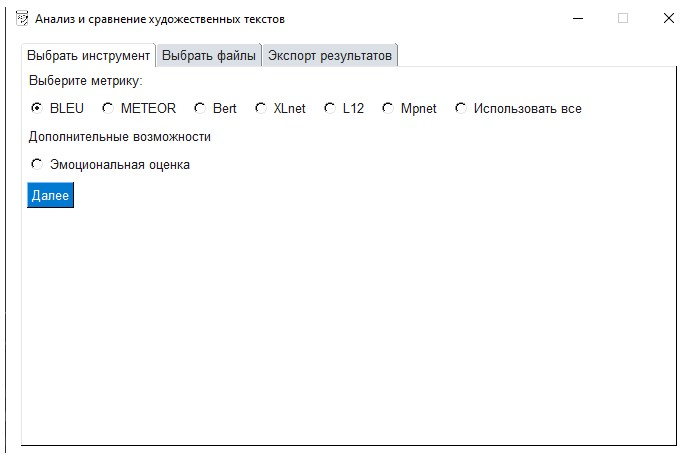
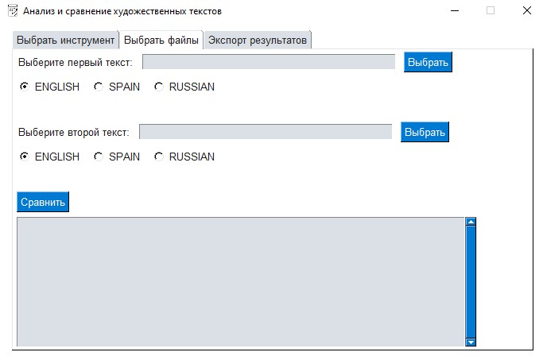
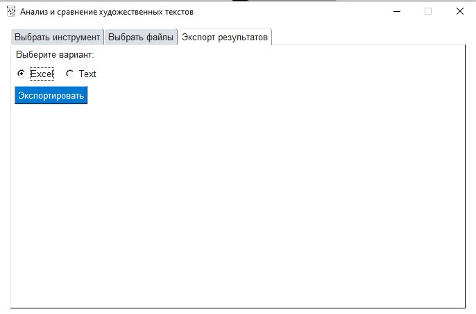
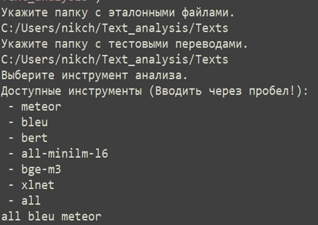

# Gonza

Ниже представлена основная информация по запуску для пользователя.


## User interface

Для запуска требуется установка всех зависимостей, описанных в README.md.

Переходим в директорию с файлом.
```cd <путь к Github>/VKR/Fiction_texts_analysis/```

Далее запускаем файл.
```python3 Gui.py```

В появившемся окне выбираем аналитический инструмент.

Далее выберите 2 docx файла и их языки (в противном случае будут определены автоматически)

Нажмите "Сравнить" для получения выбранной оценки.

Для экспорта результата в удобный формат выберите формат экспорта и нажмите "Экспортировать".


## Консольная версия

Для запуска требуется установка всех зависимостей, описанных в README.md.

Переходим в директорию с файлом.
```cd <путь к Github>/VKR/Fiction_texts_analysis/```

Далее запускаем файл.
```python3 Console.py```

Далее нужно присылать ответы на каждый из вопросов, в том числе выбрать метрику.


Важно заполнять всё верно, проверяется наличие директорий и правильность написания метрик!